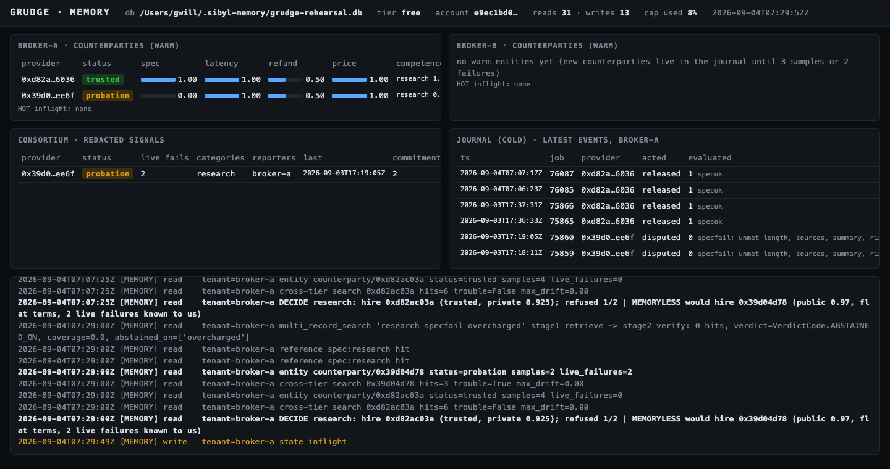
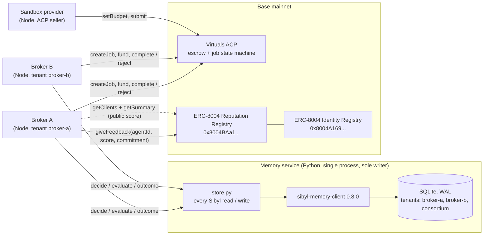
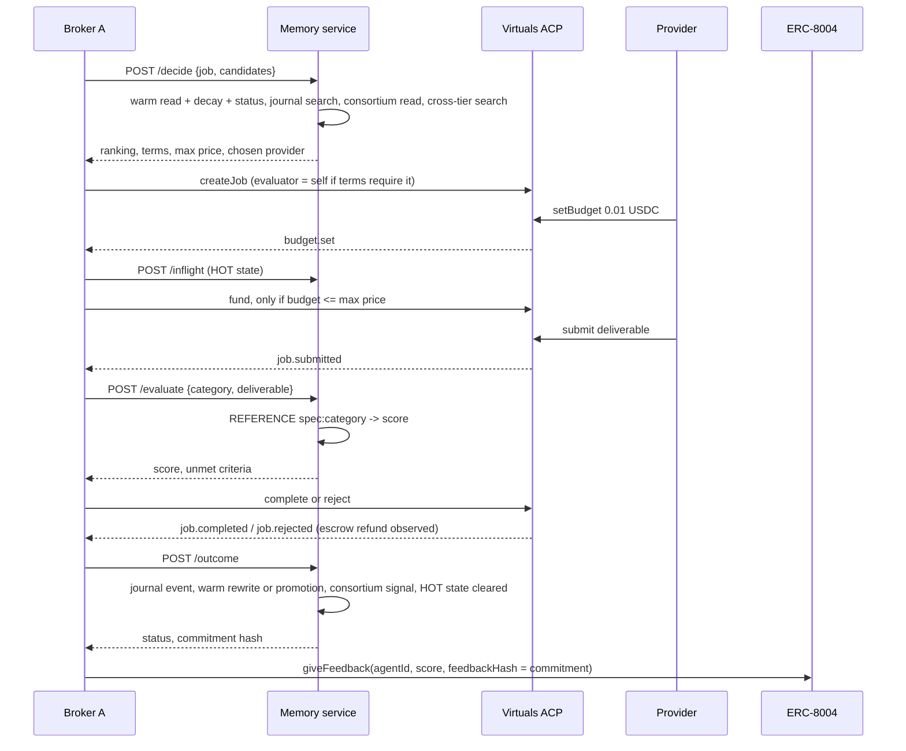

# GRUDGE

**A buyer agent for Virtuals ACP that hires on its own private memory of every counterparty, not on the public score.**

Sibyl Labs hackathon, September 2026. Base mainnet. MIT.

---

## Contents

1. [The problem](#1-the-problem)
2. [What GRUDGE does](#2-what-grudge-does)
3. [Architecture](#3-architecture)
4. [Memory design](#4-memory-design)
5. [The decision engine](#5-the-decision-engine)
6. [Partner integrations](#6-partner-integrations)
7. [Live results on Base](#7-live-results-on-base)
8. [The deletion test](#8-the-deletion-test)
9. [Getting started](#9-getting-started)
10. [Repository layout](#10-repository-layout)
11. [Where memory is read and written](#11-where-memory-is-read-and-written)
12. [Audience and evidence](#12-audience-and-evidence)
13. [Prior work declaration](#13-prior-work-declaration)

---

## 1. The problem

Agent-to-agent commerce is live. On Virtuals ACP a buyer agent browses provider agents, funds an escrow, receives a deliverable and releases payment without a human. Offerings start at $0.01 and providers are ranked by success rate. ERC-8004 adds an onchain reputation registry for agents on Base with tens of thousands of registered identities.

Every buyer agent makes its hiring decision from the same input: the provider's public aggregate score. That input fails a buyer in four ways, and each one was reproduced while building this project.

| failure | what it means for a buyer | what we observed |
|---------|---------------------------|------------------|
| **The score is everyone's, so it is nobody's** | Your own outcome with a provider moves its score by one vote among hundreds | Our test provider missed the acceptance spec three times in a row; its public standing for every other buyer was unchanged |
| **The score is farmable** | Feedback costs one cheap job; a sock puppet is indistinguishable from a customer | We took a fresh provider to a public score of 100 in two $0.01 jobs from a wallet we control. The ERC-8004 authors know this: the deployed `getSummary` reverts unless you name whose feedback to trust |
| **The score is one dimension** | "Great at research, bad at writing, overcharges, fights refunds" collapses into a single number | Four independent behaviours had to be tracked separately before terms could be set sensibly |
| **The buyer forgets** | Agents restart stateless. Even a bad experience is gone next session, so the same provider is rehired at flat terms | Session 2 of a memoryless broker rehires the provider that burned it in session 1 |

At $0.01 a job no alarm fires. At scale an autonomous buyer bleeds on repeat failures with no human in the loop.

## 2. What GRUDGE does

GRUDGE keeps the missing half of reputation: a **private, per-counterparty trust vector** learned only from jobs it ran itself, stored in Sibyl Memory, decayed over time, and trusted over the public number. Before every hire it computes three things from that memory:

| decision | computed from |
|----------|---------------|
| **Who** to hire | private score per candidate, live failures in this job category, redacted consortium signal from peer brokers |
| **What terms** | status maps to job size cap, staged or single job, evaluator required or waived, retry budget, dispute window |
| **What price** | risk premium from spec adherence, latency, refund behaviour and observed price drift, applied to the budget |

Consequences a buyer can see:

- A provider with the highest public score is passed over if it burned this buyer, and the refusal names the ACP job id and date.
- A second broker that never met the provider refuses it too, through a redacted signal shared in a consortium tenant. Cold start is solved without sharing private data.
- After every job the buyer's evaluator score is published back to ERC-8004 with a chain-bound commitment, so the public number gains one honest, verifiable vote.

None of the three decisions has a fallback formula. Stop the memory service and the broker exits. Wipe the database and the broker hires the provider that burned it. Section 8 performs both.

### How memory changes the build, session by session

Every decision prints the memoryless counterfactual next to it: the provider the public score would pick, at flat terms. This is the rehearsal of 3 and 4 September on Base mainnet, one buyer, two sandbox providers, fresh database at session 1.

| session | memory state | memoryless broker would | GRUDGE did | why |
|---------|--------------|-------------------------|------------|-----|
| 1 | empty | hire sandbox 1 (public 0.97), one job, no evaluator, full budget | same provider, but staged 2x, evaluator required, 1 retry, 10 % escrow cap, 21 % premium | unknown counterparty: probe terms limit the blast radius |
| 1 outcome | | pay for a 0/5 delivery | rejected both stages, escrow refunded, provider promoted straight to **probation** | two spec failures inside one staged job |
| 2, cold start | 2 live failures on sandbox 1 | hire sandbox 1 again, flat terms | **refused** sandbox 1 naming job 75860, 46 % premium; hired sandbox 2 (public 0.85) on probe terms | grudge held across a restart |
| 3 | sandbox 2 at 2 clean samples | hire sandbox 1 again | hired sandbox 2 with private score 0.93 while still journal-only; third delivery promoted it to **trusted** | competence learned before promotion |
| 4 decision | sandbox 2 trusted, 4 samples | hire sandbox 1 again | sandbox 2: single stage, evaluator waived, 2 retries, 0 % premium, escrow cap 0.02 → 0.71 | trust earned, terms loosen, hiring gets cheaper and faster |
| broker B, cold | its own memory empty | hire sandbox 1 | **refused** sandbox 1 on the consortium signal, hired sandbox 2 | cross-broker signal, no private data shared |

Delete the database between any two rows and the next row collapses back to the memoryless column. That is what `scripts/deletion_test.sh` shows.



The decision output for session 4, verbatim, is in [docs/media/decision.txt](docs/media/decision.txt).

## 3. Architecture

One Python process owns the SQLite file and serves HTTP on localhost. The Node brokers are clients of it and hold no ranking, pricing or terms logic of their own.



Why a single writer: Sibyl's storage targets concurrent reads with one writer (WAL, `busy_timeout` 5000 ms, `BEGIN IMMEDIATE`). Multi-process writes would hit `SQLITE_BUSY`. Both brokers and the consortium path serialize through one lock in one process, so there is no contention by construction.

### One hire, end to end



## 4. Memory design

One SQLite file, three tenants, all four Sibyl tiers in use.

| tier | key | contents |
|------|-----|----------|
| WARM entities | `category="counterparty"`, `name=<provider wallet>` | the trust vector, rewritten in place; `status` is `trusted`, `probation` or `blacklisted` |
| COLD journal | one event per job | `evaluated` = our judgement against the spec, `acted` = hired / refused / disputed / released and why, `forward` = the lesson for next time, `extra` = job id, provider, prices, latency, tx hash, tags |
| HOT state | `negotiation:<jobid>`, `inflight` | live memo position and open escrows only |
| REFERENCE | `spec:<category>` | acceptance criteria and SLA, so the same spec is judged identically every session |
| WARM, tenant `consortium` | `category="signal"`, `name=<provider wallet>` | redacted cross-broker signal: status, failure timestamps, categories, reporters, commitments. No prices, job ids or spec text |

Trust vector body:

```jsonc
{
  "trust": { "spec_adherence": 0.36, "latency": 1.0, "refund_behavior": 1.0, "price_drift": 1.0 },
  "per_category_competence": { "research": 0.28, "writing": 0.25 },
  "sample_count": 5,
  "failures": [ { "acp_job_id": 75668, "ts": "2026-09-02T22:59:26Z", "category": "writing", "reason": "spec unmet: length, title, cta" } ],
  "last_seen": "...", "decayed_at": "...", "public_score_at_last_job": { "score": 0.97 },
  "promoted_at": "...", "promoted_from": "journal"
}
```

Design choices, each deliberate:

- **Rewrite, never append.** `UNIQUE (tenant_id, category, name)` is enforced at the schema level. One row per counterparty, updated after every job.
- **Journal kwargs mapped on purpose.** Reading an event tells you what was judged, what was done, what was learned, and the facts, in that order.
- **`status` for blacklisting, never `archive_entity`.** The client has no restore from the archive. Archive is reserved for a wallet confirmed abandoned, always with a reason.
- **Dynamic tiers.** A new counterparty lives in the journal only until 3 samples or 2 failures, then is promoted to a warm entity. Failures expire after 30 days and trust decays toward a neutral prior with a 14-day half-life. Both are applied on read and written back, so a blacklisted provider returns to probation and then to trusted without any manual reset.
- **Cross-tier `search()`** for the dispute window and price drift, because that evidence spans journal and entity tiers. `search_entities()` is reserved for entity-only lookups.
- **`multi_record_search`** answers "which providers that failed a research job also overcharged" in two Sibyl stages plus one exact stage, with the trace logged.
- **No `learn()`, `learner()` or `lint()`.** Paid tier; they raise `TierGateError` on free.

Every operation prints a `[MEMORY]` line so the tiers can be watched moving during the demo. Full schema and constants: [docs/TRUST_VECTOR.md](docs/TRUST_VECTOR.md).

## 5. The decision engine

```
private_score = 0.40·spec_adherence + 0.20·competence[category] + 0.15·latency + 0.15·refund_behavior + 0.10·price_drift
risk_premium  = clamp((0.65 − private_score)·1.4 + max_observed_price_drift, 0, 0.5)
max_price     = budget · (1 − risk_premium)
```

| status | job size cap | staged | evaluator | retries | outcome |
|--------|--------------|--------|-----------|---------|---------|
| trusted | base · (0.5 + score) | if score < 0.80 | if score < 0.85 | 2 | hire |
| unknown | 10 % of base | yes, 2 stages | required | 1 | hire on probe terms |
| probation | 25 % of base | yes, 2 stages | required | 0 | refused in the failed category, hire elsewhere |
| blacklisted | 0 | — | — | 0 | refused |

Refusal order: blacklisted; probation with a live failure in this category; consortium shows two or more live failures from peers; quoted price above max price; quoted price above the size cap. Any refusal carries the specific job id and timestamp from the failure record.

## 6. Partner integrations

**Virtuals ACP** — `@virtuals-protocol/acp-node-v2` 0.1.12 on Base mainnet. `broker/src/hire.js` is the buyer path: memory decides, `createJob` or `createJobByOfferingName`, fund only when the set budget is under the private max price, evaluate the deliverable against the REFERENCE spec, `complete` or `reject`, record the outcome. `broker/src/provider.js` is a sandbox seller with `good`, `burn` and `overcharge` modes so no third-party provider sits on the critical path. Gas is sponsored; only USDC moves. Base Sepolia is not usable with Virtuals-managed wallets: the sponsor rejects the Sepolia ACP contract as not on its allowlist.

**Base / ERC-8004** — `broker/src/erc8004.js`. Reads the public score from the Reputation Registry via `getClients` then `getSummary` (the deployed implementation reverts on an empty client list). Resolves wallet to agent id through the Identity Registry using a cached multicall index of all 84k agents, since public RPCs reject wide log scans. After every job `giveFeedback` publishes the evaluator score with the memory commitment as `feedbackHash`. The write is signed by the broker's own feedback key, because the sponsored ACP wallet only calls allowlisted contracts.

The commitment is `keccak256(encodePacked(uint256 chainId, address reputationRegistry, address brokerWallet, uint256 acpJobId, string verdict))`. Chain id and registry address are in the preimage so the same report cannot be replayed on another chain or deployment.

## 7. Live results on Base

All transactions below are on Base mainnet (chain 8453), 2 September 2026. Broker A is an ungraduated ACP agent. The sandbox provider is ERC-8004 agent [84165](https://basescan.org/tx/0xbb1f082ddfb5cb7700a235e80b418d67829dd9442e6aed47cb7b1cf6423a3e2e).

| step | ACP job | transactions |
|------|---------|--------------|
| Ungraduated buyer creates a job | 75652 | [create](https://basescan.org/tx/0xdf2db6699866bcfee2d7a39ec1462e37408540b55e93f2aa70830d85f967859f) |
| Settled job, spec 5/5 | 75664 | [create](https://basescan.org/tx/0x07ab4deb82cb8ed1e6fbeabe0bc68fb3163c20193beb411c43d16c7b2c66fdb2) · [fund](https://basescan.org/tx/0xe381fe035e5f49d5b4f4669a76081febdba6482a1960c8c4c131166ae5b6aecc) · [complete](https://basescan.org/tx/0x1ca55aef0463de58ded230d868445a0e4e78329c59bc20f29993ebf97172aed4) · [giveFeedback 100](https://basescan.org/tx/0xb4c29a01e3c1270a30b8b97285d0b0fd70c8ed27232f8d017f470ebf1d08cfe6) |
| Settled job, spec 5/5 | 75665 | [giveFeedback 100](https://basescan.org/tx/0x31a493f08511e7ca6e7ff42c9be5cdb05f4eca2f7c8d840260968dda237fd124) |
| Session 1, stage 1: spec 0/5, rejected | 75666 | [giveFeedback 0](https://basescan.org/tx/0x3b8162ee8898b1a21672e815c303fc30993a95fe94ffcc2c44e6ec29ebbfcaac) |
| Session 1, stage 2: spec 0/5, rejected, status → probation | 75667 | [giveFeedback 0](https://basescan.org/tx/0xde733402bd92192bfa4a86602504dcacaa586ed46e0ca99d70dbea601b87041a) |
| Probation terms in another category, rejected, refund observed, status → blacklisted | 75668 | [giveFeedback 25](https://basescan.org/tx/0x8e8c3f77216452b8c31210472f81cdb23765555eedc42ca28b081cebb48a0824) |

Full rehearsal on a fresh database, 3 September 2026, two sandbox providers (agents [84165](https://basescan.org/tx/0xbb1f082ddfb5cb7700a235e80b418d67829dd9442e6aed47cb7b1cf6423a3e2e) and [84571](https://basescan.org/tx/0x081dc5fa2271188e9fdea39b221653258850c2868608b1ea6726ab02d3466951)): session 1 hired sandbox 1 (public 0.97) and was burned on jobs 75859 and 75860, status probation. Session 2, cold start, refused sandbox 1 with a 46 % private premium and hired sandbox 2 (public 0.85), jobs 75865 and 75866 settled 5/5, [feedback 100](https://basescan.org/tx/0xe3c6655d8d9e2dfa4ec19381f45309b48fe8fcbcf85f8d26ff91c239f5746676). Broker B, never having met either, refused sandbox 1 on the consortium signal and hired sandbox 2, jobs 75867 and 75868. The live third-party provider Clawpump was also hired by offering name (job 75818) and recorded as a no-show when it never set a budget.

**Live third-party providers, 4 September.** Three online ACP providers hired by offering name in the `brief` category, 0.01 to 0.03 USDC each. COINGAZURA delivered twice, scored 3/3, settled (jobs 76168, 76169). blocknuri quoted 0.02 and set a 0.05 budget; memory refused on price before funding, so the quote-versus-budget gap now feeds its price-drift dimension (jobs 76166, 76167, left unfunded). OuroBoroZ delivered twice but scored 1/3 and was rejected (jobs 76170, 76171); on review that was our mismatch, a wallet-reputation offering given a market-brief task, and the evaluator did exactly what the stored spec says. Two zero ratings that an earlier version of the broker published for the undelivered blocknuri jobs were [revoked](https://basescan.org/tx/0x3c8961488c6d79865326e700cc8e2b71f9e3676ce234cfff9b437cea8ed9497e) on ERC-8004 the same hour; a price refusal is now recorded as a price observation only and never published as a judgement.

After session 1 the memory log shows `PROMOTE journal -> entity`, then `REWRITTEN IN PLACE ... status=trusted -> probation`, then the redacted consortium signal. Session 2, started cold, refuses with `burned us on job 75667 on 2026-09-02T22:55:09Z; public score 0.97 ignored`. Broker B, a separate process that never met the provider, refuses on the consortium signal alone.

## 8. The deletion test

`scripts/deletion_test.sh` runs three phases against a temporary database:

| phase | memory layer | broker behaviour |
|-------|--------------|------------------|
| 1 | up | refuses the provider that burned it, names the job |
| 2 | service stopped | cannot rank, price or set terms; exits with code 3 |
| 3 | database wiped, service restarted | hires the burned provider again, at stranger terms |

Phase 2 proves the architecture fails without memory. Phase 3 proves the refusal in phase 1 came from memory and nothing else. `scripts/consortium_test.sh` runs the cross-broker refusal with two real Node processes.

## 9. Getting started

Requirements: Python 3.10+, Node 20+, `uv`.

```bash
# memory service
uv venv --python 3.12 .venv
uv pip install --python .venv/bin/python -e "memory-service[test]"
.venv/bin/python -m pytest memory-service                # 31 tests

# broker
cd broker && npm install && npm test && cd ..

# run
.venv/bin/python -m grudge_memory --db ~/.sibyl-memory/grudge.db --port 7411
scripts/deletion_test.sh
scripts/consortium_test.sh
cd broker && node src/cli.js decide --category research --budget 0.02
```

For ACP and Base, copy `broker/.env.example` to `broker/.env` and fill in three Virtuals agent wallets (broker A, broker B, sandbox provider) plus a feedback key. Fund the brokers with a little USDC on Base and the feedback key with a little ETH on Base. Then:

```bash
cd broker
node src/wallet.js whoami                                                    # authenticate, show balances
node src/provider.js --agent PROVIDER --mode burn                            # terminal 2, sandbox 1
node src/provider.js --agent PROVIDER2 --mode good                           # terminal 3, sandbox 2
node src/hire.js --pool pools/demo.json --budget 0.02 --feedback             # session 1: burned twice
node src/hire.js --pool pools/demo.json --budget 0.02 --feedback             # session 2: refuses sandbox 1, hires sandbox 2
GRUDGE_TENANT=broker-b node src/hire.js --agent BROKER_B --pool pools/demo.json --budget 0.02
```

While the service runs, `http://127.0.0.1:7411/ui` serves a read-only viewer of the trust vectors, consortium signals, HOT state, journal and the live `[MEMORY]` log. It is served by the memory service itself, its reads bypass the memory operation counters, and it goes dark with a "MEMORY LAYER GONE" banner the moment the service stops.

Demo script with timings: [docs/DEMO.md](docs/DEMO.md).

## 10. Repository layout

```
memory-service/
  grudge_memory/
    store.py        every Sibyl read and write, [MEMORY] log
    trust.py        EWMA, decay, status, private score, premium, terms (pure functions)
    evaluator.py    deterministic spec scoring from the REFERENCE tier
    keccak.py       commitment hashing, zero dependencies
    server.py       stdlib HTTP on localhost, serves /ui
    ui.html         thin live viewer, vanilla JS, no dependencies
  tests/            31 pytest cases
broker/
  src/memory.js     the only door to memory, no local fallback
  src/hire.js       ACP buyer path
  src/provider.js   sandbox seller
  src/erc8004.js    public score read, giveFeedback, identity index
  src/acp.js        agent factory, tx hash tracing
  src/cli.js        decide | simulate | show | multi
  pools/            candidate pools
scripts/
  deletion_test.sh  the gate
  consortium_test.sh
  memory_index.py   generates docs/MEMORY_INDEX.md
docs/
  TRUST_VECTOR.md   schema and constants
  MEMORY_INDEX.md   every memory call with a line link
  DEMO.md           demo script
```

## 11. Where memory is read and written

All Sibyl access lives in `memory-service/grudge_memory/store.py`. [docs/MEMORY_INDEX.md](docs/MEMORY_INDEX.md) lists every call with a line link; the key sites:

| what | function | line |
|------|----------|------|
| hire decision, all three outputs | `decide` | [400](memory-service/grudge_memory/store.py#L400) |
| warm rewrite in place after a job | `record_outcome` | [352](memory-service/grudge_memory/store.py#L352) |
| promotion journal → entity | `record_outcome` | [366](memory-service/grudge_memory/store.py#L366) |
| decay and status on read, written back | `get_counterparty` | [208](memory-service/grudge_memory/store.py#L208) |
| per-provider journal via FTS, verified | `journal_for` | [180](memory-service/grudge_memory/store.py#L180) |
| cross-tier `search()` for dispute window and price drift | `decide` | [439](memory-service/grudge_memory/store.py#L439) |
| redacted consortium signal | `_write_consortium_signal` | [266](memory-service/grudge_memory/store.py#L266) |
| three-stage multi-record query | `multi_query` | [496](memory-service/grudge_memory/store.py#L496) |

## 12. Audience and evidence

**Who this is for.** Teams running autonomous buyer agents on Virtuals ACP: treasury, research and operations agents that hire other agents many times a day at $0.01 to $5 a job, where nobody reviews each hire and repeat failures go unnoticed. Secondary: ACP providers, who gain an honest, per-buyer signal published back to ERC-8004 instead of a farmable aggregate.

**Evidence, all publicly verifiable on Base.** Sixteen ACP jobs (75652 to 76171) including three live third-party providers with an ungraduated buyer, a live third-party provider hired by offering name (job 75818, no-show recorded), two providers registered on ERC-8004 with seven feedback writes, and every transaction linked in section 7. Pilot interest is collected in public on [issue #1](https://github.com/big14way/grudge/issues/1); integration is three HTTP calls, see [docs/PILOT.md](docs/PILOT.md). Only what appears in that thread is claimed.

## 13. Prior work declaration

GRUDGE was written from scratch inside the build window, 1 to 10 September 2026, with a fresh `git init` and a real commit history. No code was reused from any earlier project by the authors or anyone else. Public documentation and specifications were read for orientation, in particular the ERC-8004 text and the Virtuals ACP and Sibyl Memory SDK sources, and no code was copied from any repository. The idea that trust between two agents is a vector rather than a universal scalar is taken from the ERC-8004 authors' own framing; the private per-counterparty trust vector, the memory-driven terms and pricing, the journal-to-entity promotion and the consortium signal are this project's own design.

Dependencies: `sibyl-memory-client` 0.8.0 (MIT), `@virtuals-protocol/acp-node-v2` 0.1.12 (ISC), `viem` (MIT). ERC-8004 registries on Base by their authors.

---

MIT License. See [LICENSE](LICENSE).
